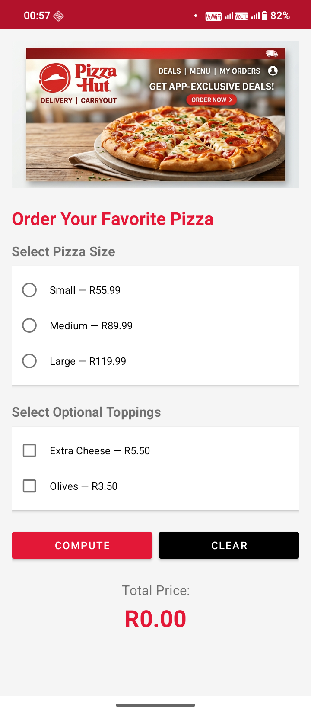

# Pizza Hut Ordering System — Android App

A native Android application built in Kotlin that allows users to order pizzas from Pizza Hut. The app features a themed UI, price calculation logic, and detailed event logging.

## Features
- **Pizza Size Selection**: Choose from Small, Medium, or Large with real-time price updates.
- **Optional Toppings**: Add Extra Cheese or Olives to your order.
- **Real-time Price Calculation**: Compute the total cost including South African Rand (R) formatting.
- **Input Validation**: Displays a friendly error if a user tries to compute without selecting a size.
- **Clear Functionality**: Reset all selections and totals with a single click.
- **Detailed Logging**: All user interactions (size chosen, toppings added, total price, errors) are logged for debugging via `Log.d()`.

## UI Design Decisions
- **Pizza Hut Branding**: The app uses the official red and white color scheme (`#E31837`) to provide a premium and authentic feel.
- **Material Design**: Utilizes Material components like `elevation` and `backgroundTint` for a modern, responsive look.
- **Responsive Layout**: Wrapped in a `ScrollView` to ensure compatibility across different screen sizes.
- **Engaging Visuals**: Includes a professional banner image to welcome users.

## How to Run
1. Open the project in **Android Studio**.
2. Sync the project with Gradle files.
3. Run the app on an Android Emulator or physical device.
4. View logs in the **Logcat** window by filtering for the tag: `PizzaHutOrdering`.

## Screenshots

## Technical Specifications
- **Language**: Kotlin 1.9.0
- **Min SDK**: API 24 (Android 7.0)
- **Target SDK**: API 34 (Android 14)
- **Architecture**: XML Layouts + MainActivity logic.
- **Control Flow**: Implemented using strict `if/else-if` statements as per system requirements.
